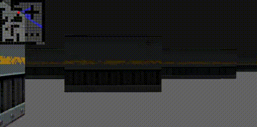

# 3D Raycasting Engine

Raycasting engine written in C using SDL2 library. Uses DDA algorithm to cast rays and detect collisions. Reads raw data from uncompressed BMPs as textures.


## Screenshots




## Requirements

- sdl2
- sdl2_image


## Building
Clone the project
```bash
  git clone https://github.com/blr-ophon/simple3DRC
```
Compile using:

```bash
  cd simple3DRC 
  make
```
## Running

Run the executable directly or use make:

```bash
  make run
```


## Usage

Use WASD to move

Use `esc` to quit 

